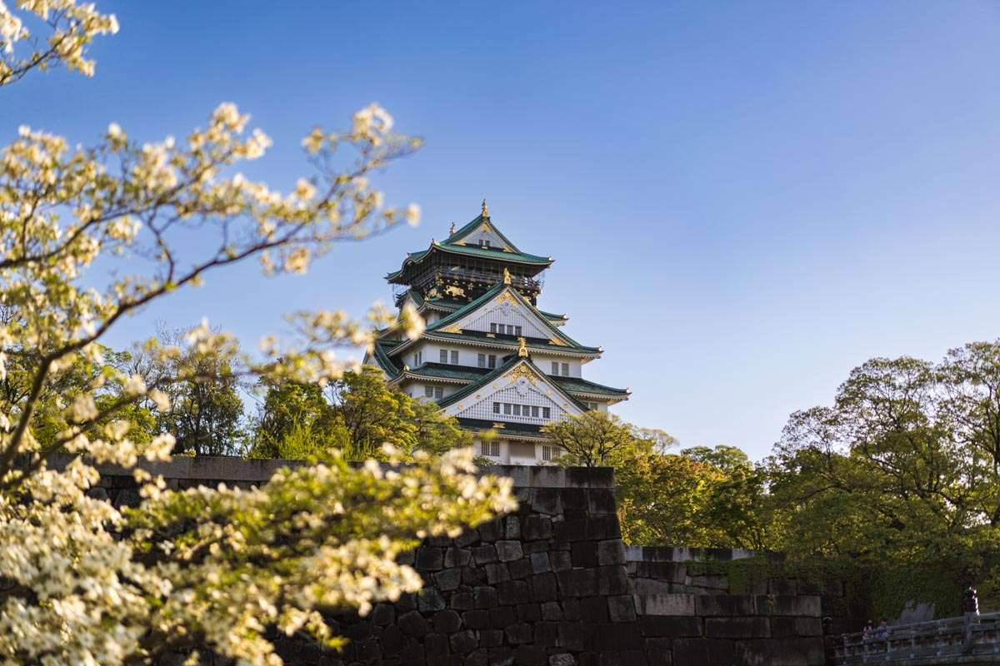

# Osaka 大阪

Osaka is Japan's kitchen and the heart of Kansai culture. Known for its food scene, friendly locals, and vibrant street life, it's where you'll find takoyaki vendors on every corner and neon-lit entertainment districts that stay busy well past midnight. The city balances modern urban energy with historical sites like Osaka Castle, while districts like Dotonbori and Shinsekai offer distinctly different flavors of local life. It's less polished than Tokyo but more approachable, making it a good base for exploring the Kansai region.

**Main spot types:** Street food, nightlife, shopping, historical sites

Jump to topic from here
- [Shopping](#shopping)
- [Food](#food)

<!--

## Spot Template

### Spot Name

| Field | Value |
|-------|-------|
| **Type** | |
| Description | |
| **Nearest Station** | |
| **Google Maps** | [Link]() |
| **Recommended Season/Month** | |

Description goes here.

---

Copy and use the above template for each spot entry

-->

## Shopping
> Below are some hot shopping spot

### KITTE OSAKA

| Field                        | Value                   |
| ---------------------------- | ----------------------- |
| **Type**                     | Shopping / Urban Stroll |
| **Description**              | Modern mall with shops, food, and rooftop gardens. |
| **Nearest Station**          | Osaka Station           |
| **Google Maps**              | [Link]()                |
| **Recommended Season/Month** | Year-round              |

---

### Grand Green Osaka

| Field                        | Value                    |
| ---------------------------- | ------------------------ |
| **Type**                     | Urban Park / Development |
| **Description**              | Spacious park with lawns, paths, and cafés. |
| **Nearest Station**          | Osaka Station            |
| **Google Maps**              | [Link]()                 |
| **Recommended Season/Month** | Spring or Autumn         |

---

### Inogate Osaka

| Field                        | Value                 |
| ---------------------------- | --------------------- |
| **Type**                     | Food & Retail Complex |
| **Description**              | Shops and eateries under the train tracks. |
| **Nearest Station**          | Osaka Station         |
| **Google Maps**              | [Link]()              |
| **Recommended Season/Month** | Year-round            |

---

## Food

> Below are foods in Osaka.

### YAKINIKU IZAKAYA ONINI KANABO Fukushima

| Field                        | Value                        |
| ---------------------------- | ---------------------------- |
| **Type**                     | Food (Yakiniku Izakaya)      |
| **Description**              | Cozy spot for grilled meats and drinks. |
| **Nearest Station**          | Fukushima Station            |
| **Google Maps**              | [Link]()                     |
| **Recommended Season/Month** | Winter (but good year-round) |

---

### Stand Bar Jack & Matilda

| Field                        | Value                          |
| ---------------------------- | ------------------------------ |
| **Type**                     | Food / Bar                     |
| **Description**              | Lively standing bar for drinks and snacks. |
| **Nearest Station**          | Fukushima Station              |
| **Google Maps**              | [Link]()                       |
| **Recommended Season/Month** | Autumn evenings or late nights |

---

### Moeyo Mensuke

| Field                        | Value                |
| ---------------------------- | -------------------- |
| **Type**                     | Food (Ramen)         |
| **Description**              | Popular ramen shop with rich broth. |
| **Nearest Station**          | Fukushima Station    |
| **Google Maps**              | [Link]()             |
| **Recommended Season/Month** | Winter or rainy days |

---

### Ramen Jinsei JET

| Field                        | Value             |
| ---------------------------- | ----------------- |
| **Type**                     | Food (Ramen)      |
| **Description**              | Bold ramen with rich chicken broth. |
| **Nearest Station**          | Fukushima Station |
| **Google Maps**              | [Link]()          |
| **Recommended Season/Month** | Year-round        |

---

### Ressi Shoyu Menkobo Sanku

| Field                        | Value                  |
| ---------------------------- | ---------------------- |
| **Type**                     | Food (Shoyu Ramen)     |
| **Description**              | Traditional shoyu ramen in a quiet spot. |
| **Nearest Station**          | Fukushima Station      |
| **Google Maps**              | [Link]()               |
| **Recommended Season/Month** | Early spring or autumn |

---

### HARETOKE Sake Seller

| Field                        | Value                       |
| ---------------------------- | --------------------------- |
| **Type**                     | Specialty Store / Alcohol   |
| **Description**              | Sake shop with unique bottles and friendly staff. |
| **Nearest Station**          | Umeda Station               |
| **Google Maps**              | [Link]()                    |
| **Recommended Season/Month** | Autumn–Winter (sake season) |
